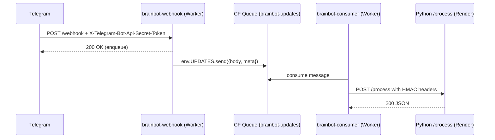

# BrainBot Technical Design

## Architecture Overview

BrainBot follows a modular architecture with clear separation of concerns between bot interaction, message processing, storage, and intelligence layers.


## Component Design

### 1. Bot Layer

#### Webhook Server (Production)
```python
# webhook_server.py
class WebhookServer:
    app: FastAPI
    bot: Application
    
    async def webhook_handler(update: dict) -> Response
    async def health_check() -> dict
    async def metrics() -> dict
```

#### Message Handlers
```python
# src/bot/handlers.py
class MessageHandler:
    async def handle_command(update: Update, context: Context)
    async def handle_message(update: Update, context: Context)
    async def handle_document(update: Update, context: Context)
```

### 2. Smart Rails Router

#### Route Processing Flow


#### Router Architecture
```python
@dataclass
class RouteResult:
    entity_type: Optional[str]  # 'lists', 'tasks', 'field_reports'
    operation: Optional[str]     # 'create', 'add_items', 'complete', etc.
    confidence: float           # 0.0 to 1.0
    extracted_data: Dict[str, Any]
    use_direct_execution: bool  # Skip LLM if confidence = 1.0
    
class SmartRailsRouter:
    def preprocess_message(self, message: str) -> Tuple[str, Dict, Dict]
    def route(self, message: str, user_context: Dict) -> RouteResult
    def get_processor(self, entity_type: str) -> BaseProcessor
```

### 3. Entity Processors

#### Base Processor Interface
```python
class BaseProcessor(ABC):
    @abstractmethod
    async def process(self, data: Dict, user_context: Dict) -> ProcessResult
    
    @abstractmethod
    def get_extraction_schema(self) -> Dict
    
    @abstractmethod
    def validate_data(self, data: Dict) -> Tuple[bool, List[str]]
```

#### Processor Implementations
- **ListProcessor**: Handles shopping lists, tool lists, etc.
- **TaskProcessor**: Manages tasks with assignees and due dates
- **FieldReportProcessor**: Processes field reports with sites and dates

### 4. Storage Architecture

#### Document Storage
```python
class DocumentStorage:
    async def create_document(type: str, content: str, metadata: Dict) -> Document
    async def update_document(id: str, content: str) -> Document
    async def search_documents(query: str, filters: Dict) -> List[Document]
    async def get_document_by_id(id: str) -> Document
```

#### Vector Store Integration
```python
class VectorStore:
    async def upsert(id: str, content: str, metadata: Dict)
    async def search(query: str, top_k: int, namespace: str) -> List[Result]
    async def delete(id: str)
    
    # Performance optimizations
    def _get_cached_result(query: str) -> Optional[List[Result]]
    def _cache_result(query: str, results: List[Result])
```

### 5. Memory System (mem0)

#### Memory Architecture


## Data Models

### Database Schema (Supabase)

```sql
-- Personnel table for authorization
CREATE TABLE personnel (
    id UUID PRIMARY KEY,
    telegram_id BIGINT UNIQUE,
    telegram_username TEXT,
    first_name TEXT NOT NULL,
    aliases TEXT[], -- Array of alternative names
    role TEXT,
    created_at TIMESTAMPTZ DEFAULT NOW()
);

-- Documents table
CREATE TABLE documents (
    id UUID PRIMARY KEY,
    user_id BIGINT NOT NULL,
    type TEXT NOT NULL, -- 'list', 'task', 'field_report'
    title TEXT NOT NULL,
    content TEXT NOT NULL,
    metadata JSONB,
    vector_id TEXT, -- Reference to vector store
    created_at TIMESTAMPTZ DEFAULT NOW(),
    updated_at TIMESTAMPTZ DEFAULT NOW()
);

-- Audit log for all operations
CREATE TABLE audit_log (
    id UUID PRIMARY KEY,
    user_id BIGINT NOT NULL,
    operation TEXT NOT NULL,
    entity_type TEXT,
    entity_id UUID,
    details JSONB,
    created_at TIMESTAMPTZ DEFAULT NOW()
);
```

### Document Format (Markdown + YAML)

```markdown
---
title: Eagle Lake Shopping List
type: list
site: eagle-lake
assignee: bryan
created: 2025-01-30T10:00:00Z
updated: 2025-01-30T14:30:00Z
tags: [shopping, supplies, eagle-lake]
status: active
---

# Eagle Lake Shopping List

## Safety Equipment
- [ ] Hard hats (5)
- [ ] Safety vests (5)
- [x] First aid kit

## Tools
- [ ] Voltage meter
- [ ] Cable tester
```

## API Design

### Internal Service APIs

```python
# LLM Service API
class LLMService:
    async def extract_entities(
        message: str, 
        schema: Dict,
        context: Dict
    ) -> ExtractedData
    
    async def generate_response(
        query: str,
        search_results: List[Document],
        conversation_history: List[Message]
    ) -> str

# Storage Service API  
class StorageAPI:
    async def store_document(doc: Document) -> str
    async def retrieve_document(id: str) -> Document
    async def search_documents(
        query: str,
        filters: Dict,
        limit: int
    ) -> List[Document]
```

### Webhook Endpoints

```yaml
POST /webhook
  Description: Receives Telegram updates
  Request: Telegram Update object
  Response: 200 OK

GET /health
  Description: Health check endpoint
  Response: {"status": "healthy", "version": "1.0.0"}

GET /metrics
  Description: Performance metrics
  Response: {
    "requests_total": 1000,
    "average_response_time_ms": 234,
    "vector_search_cache_hit_rate": 0.85
  }
```

## Performance Optimizations

### Caching Strategy

```python
# Vector search caching
CACHE_KEY = f"vector_search:{namespace}:{query_hash}"
CACHE_TTL = 300  # 5 minutes

# Redis conversation caching
CONV_KEY = f"conversation:{user_id}"
CONV_TTL = 86400  # 24 hours
```

### Connection Pooling

```python
# Database connection pool
DATABASE_POOL_SIZE = 20
DATABASE_MAX_OVERFLOW = 10

# Redis connection pool
REDIS_POOL_SIZE = 50
REDIS_TIMEOUT = 30
```

## Error Handling

### Retry Strategy

```python
@retry(
    stop=stop_after_attempt(3),
    wait=wait_exponential(multiplier=1, min=4, max=10),
    retry=retry_if_exception_type(TransientError)
)
async def reliable_operation():
    # Operation that might fail transiently
```

### Error Response Format

```json
{
    "error": {
        "code": "VECTOR_SEARCH_FAILED",
        "message": "Unable to search vector database",
        "details": {
            "retry_after": 60,
            "fallback": "keyword_search"
        }
    }
}
```

## Security Considerations

### Authentication Flow


### Data Protection

- All API keys stored in environment variables
- TLS encryption for all external API calls
- User data isolation through database row-level security
- Sensitive data never logged or included in error messages

## Deployment Architecture

### Production Evolution: Python to Cloudflare Migration

#### Current State (Python on Render)

```yaml
services:
  - type: web
    name: brainbot
    env: python
    buildCommand: pip install -r requirements.txt
    startCommand: python webhook_server.py
    envVars:
      - key: TELEGRAM_BOT_TOKEN
        sync: false
      - key: OPENAI_API_KEY
        sync: false
    healthCheckPath: /health
```

#### Migration Target (Cloudflare Workers)

```mermaid
graph TB
    subgraph "Cloudflare Edge Infrastructure"
        TG[Telegram Webhook] --> WH[brainbot-webhook<br/>Worker]
        WH --> Q[Queues:<br/>brainbot-updates]
        Q --> C[brainbot-consumer<br/>Worker]
        
        subgraph "Storage Layer"
            KV[KV Namespace<br/>Metadata]
            R2[R2 Bucket<br/>Documents]
            VEC[Vectorize<br/>Embeddings]
        end
        
        subgraph "Processing"
            C --> SR[Smart Rails<br/>Durable Object]
            C --> EP[Entity Processors<br/>Durable Objects]
            SR --> KV
            EP --> KV
            EP --> R2
            EP --> VEC
        end
        
        C --> N8N[n8n Workflows<br/>Complex Orchestration]
        C --> PY[Python /process (Render)<br/>HMAC-auth proxy]
    end
```

##### Cloudflare Worker Configuration

```toml
# wrangler.toml for consumer
name = "brainbot-consumer"
main = "src/consumer.ts"
compatibility_date = "2024-08-01"

[[queues.consumers]]
queue = "brainbot-updates"

[[kv_namespaces]]
binding = "BRAINBOT_KV"
id = "406b3a3a56cb448fa62e9fa032c6a4a6"

[[r2_buckets]]
binding = "BRAINBOT_MEDIA"
bucket_name = "brainbot-media"

[[vectorize]]
binding = "VECTORIZE"
index_name = "brainbot-docs"

## (Optional) Durable Objects (Phase 5+)
## [[durable_objects.bindings]]
## name = "SMART_RAILS"
## class_name = "SmartRailsDO"
## [[durable_objects.bindings]]
## name = "ENTITY_PROCESSOR"
## class_name = "EntityProcessorDO"

[vars]
N8N_WEBHOOK_URL = "https://n8n.example.com/webhook/brainbot"
PROCESS_URL = "https://brainbot-v76n.onrender.com/process"
### Cloudflare sequence (Phase 1)



### Secrets & Bindings

- Shared HMAC: `CF_PROXY_SECRET` bound to both Workers and set in Render env
- Webhook secret: `TELEGRAM_WEBHOOK_SECRET` bound to `brainbot-webhook`; used as `secret_token` in Telegram setWebhook
- Queue producer binding on webhook: `UPDATES → brainbot-updates`
- Queue consumer binding on consumer: `brainbot-updates`
- Other bindings: `BRAINBOT_KV`, `BRAINBOT_MEDIA`, `VECTORIZE`

### Tooling & Automation

- Cloudflare Wrangler
  - Deploy/tail Workers: `npx wrangler@latest deploy`, `npx wrangler@latest tail`
  - Provision resources (done): `wrangler vectorize create`, `wrangler r2 bucket create`, `wrangler queues create`, `wrangler kv:namespace create`
- Render CLI
  - Used to verify service and manage restarts; env set via dashboard; `/process` lives at `https://brainbot-v76n.onrender.com/process`
- MCP (Context7/Cloudflare/Sliplane)
  - Cloudflare docs MCP used to reference up‑to‑date API semantics
  - Sliplane MCP available for future workflow automation (n8n integration and remote actions)
  - Render MCP used for status checks and scripted deploys if desired

Notes
- Render’s `main.py` auto-sets Telegram webhook; disable this to avoid overwriting the Worker URL once cutover is complete.
```

### Development (Local)

```bash
# Python development (current)
python -m venv venv
source venv/bin/activate
pip install -r requirements.txt
python run_bot.py

# TypeScript development (migration)
npm install
wrangler dev --local
```

---

## Extending the Design

When adding new features:
1. Update the architecture diagram if new components are added
2. Define new data models and their relationships
3. Document API changes and new endpoints
4. Consider performance implications and add optimizations
5. Ensure security model covers new functionality