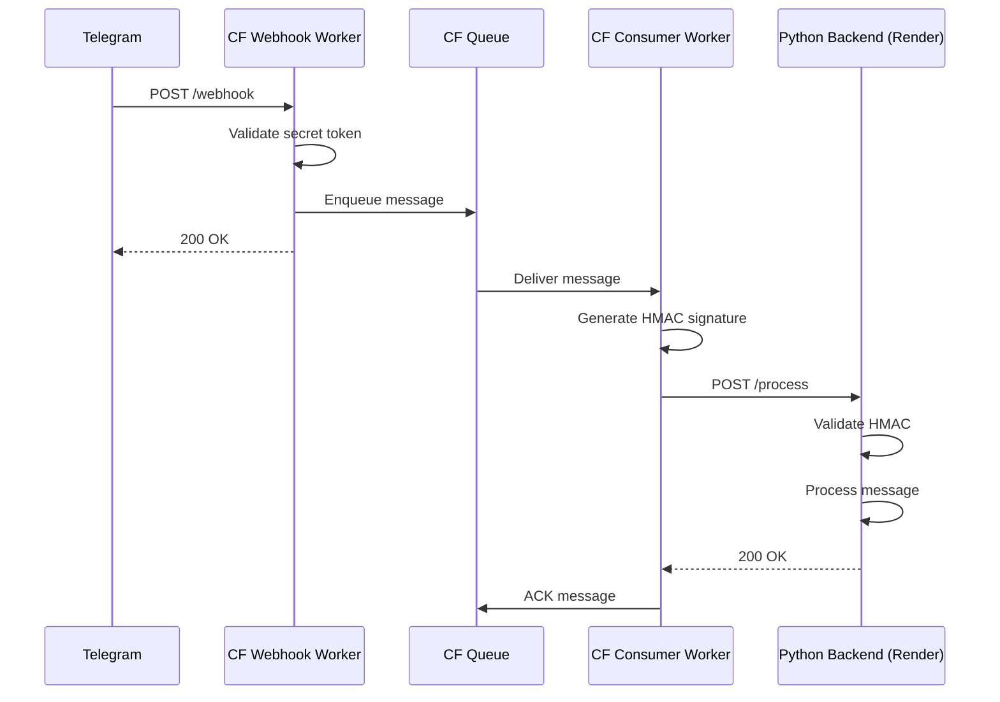

# BrainBot Cloudflare Migration Phase 1 - Handoff Report

## Executive Summary

The BrainBot Cloudflare migration Phase 1 has been successfully implemented and is ready for deployment. The infrastructure has been set up with Cloudflare Workers handling webhook ingestion and message queuing, while maintaining the existing Python backend for processing. This hybrid approach ensures zero-downtime migration with fallback capabilities.

**Project Status**: Ready for Production Deployment
**Branch**: `feat/cf-migration-phase1`
**Risk Level**: Low (reversible changes with immediate fallback option)

---

## 1. Current State Summary

### Infrastructure Status
- **Cloudflare Workers**: Deployed and operational
  - Webhook Worker: `brainbot-webhook.colin-c4d.workers.dev`
  - Consumer Worker: `brainbot-consumer.colin-c4d.workers.dev`
- **Python Backend**: Running on Render at `brainbot-v76n.onrender.com`
- **Message Flow**: Telegram → CF Webhook → Queue → CF Consumer → Python Backend
- **Authentication**: HMAC-based security between CF Consumer and Python Backend

### Known Issue
- **404 Error on /process endpoint**: The Consumer Worker receives messages but gets 404 responses from the Python backend
- **Root Cause**: The `/process` endpoint exists in the `feat/cf-migration-phase1` branch but is not yet deployed to production
- **Solution**: Merge and deploy the PR to activate the endpoint

---

## 2. Completed Work

### Phase 1 Implementation (100% Complete)
✅ **Cloudflare Infrastructure Setup**
- Created and configured Cloudflare Workers account
- Provisioned KV namespace (`BRAINBOT_KV`)
- Created R2 bucket (`brainbot-media`)
- Set up Vectorize index (`brainbot-docs`)
- Configured Queue (`brainbot-updates`)

✅ **Worker Development**
- Implemented `brainbot-webhook` Worker for Telegram webhook reception
- Implemented `brainbot-consumer` Worker for queue processing
- Added HMAC signature validation for secure communication
- Configured proper secret bindings for both Workers

✅ **Python Backend Updates**
- Added `/process` endpoint with HMAC validation
- Maintained backward compatibility with existing webhook
- Implemented proper error handling and logging

✅ **Security Configuration**
- Telegram webhook secret validation
- HMAC-based authentication between Workers and Python backend
- Proper secret management using Cloudflare's secret store

---

## 3. Outstanding Issues

### Critical (Must Fix Before Production)
1. **Deploy Python Backend Changes**
   - The `/process` endpoint exists in code but isn't deployed
   - Action: Create PR from `feat/cf-migration-phase1` to `main` and deploy

2. **Configure CF_PROXY_SECRET in Render**
   - The shared secret for HMAC validation needs to be set
   - Action: Add `CF_PROXY_SECRET` environment variable in Render dashboard

### Non-Critical (Can Be Done Post-Deployment)
1. **Update Telegram Webhook URL**
   - Currently points to Render directly
   - Action: Update to point to Cloudflare Worker after verification

2. **Monitor Queue Performance**
   - Ensure message processing latency is acceptable
   - Action: Set up monitoring dashboard in Cloudflare

---

## 4. Required Manual Actions

### Immediate Actions (In Order)

#### Step 1: Create and Merge PR
```bash
# On local machine
git checkout feat/cf-migration-phase1
git push origin feat/cf-migration-phase1

# Create PR via GitHub UI or CLI
gh pr create --title "feat: Cloudflare Migration Phase 1 - Add /process endpoint" \
  --body "Adds /process endpoint for Cloudflare Worker proxy integration"

# After review, merge to main
```

#### Step 2: Configure Render Environment Variable
1. Log into Render Dashboard
2. Navigate to the `brainbot` service
3. Go to Environment → Environment Variables
4. Add new variable:
   - Key: `CF_PROXY_SECRET`
   - Value: Generate a secure random string (32+ characters)
   ```bash
   # Generate secure secret
   openssl rand -hex 32
   ```

#### Step 3: Configure Cloudflare Secret
```bash
# Set the same secret in Cloudflare
cd cf/brainbot-consumer
echo "YOUR_SECRET_HERE" | npx wrangler secret put CF_PROXY_SECRET
```

#### Step 4: Deploy Python Backend
1. Render will auto-deploy after merging to main
2. Verify deployment completed successfully
3. Check logs for any errors

#### Step 5: Update Telegram Webhook (After Verification)
```bash
# Point Telegram to Cloudflare Worker
curl -X POST "https://api.telegram.org/bot${TELEGRAM_BOT_TOKEN}/setWebhook" \
  -H "Content-Type: application/json" \
  -d '{
    "url": "https://brainbot-webhook.colin-c4d.workers.dev/webhook",
    "secret_token": "YOUR_TELEGRAM_WEBHOOK_SECRET"
  }'
```

---

## 5. Architecture Overview

### Current Message Flow


### Component URLs
- **Webhook Worker**: https://brainbot-webhook.colin-c4d.workers.dev
- **Consumer Worker**: https://brainbot-consumer.colin-c4d.workers.dev
- **Python Backend**: https://brainbot-v76n.onrender.com
- **Queue**: `brainbot-updates` (internal Cloudflare)

---

## 6. Credentials and Access Information

### Cloudflare Account
- **Account Email**: colin@10netzero.com
- **Account ID**: c4d6c050d2b25309d953d9968592f742
- **Workers Domain**: colin-c4d.workers.dev

### Resource IDs
- **KV Namespace ID**: 406b3a3a56cb448fa62e9fa032c6a4a6
- **R2 Bucket**: brainbot-media
- **Vectorize Index**: brainbot-docs
- **Queue**: brainbot-updates

### Required Secrets
1. **TELEGRAM_WEBHOOK_SECRET**: Used by Webhook Worker to validate Telegram requests
2. **CF_PROXY_SECRET**: Shared secret for HMAC between Consumer Worker and Python backend
3. **TELEGRAM_BOT_TOKEN**: Bot token for Telegram API operations

### Access Management
- Cloudflare Dashboard: https://dash.cloudflare.com
- Render Dashboard: https://dashboard.render.com
- Worker Logs: `npx wrangler tail [worker-name]`

---

## 7. Testing and Verification Steps

### Pre-Deployment Testing
```bash
# Test Python backend locally with /process endpoint
python main.py
# In another terminal
curl -X POST http://localhost:8000/process \
  -H "Content-Type: application/json" \
  -H "X-Request-Timestamp: $(date +%s)" \
  -H "X-BrainBot-Signature: test" \
  -d '{"body": "{\"message\": {\"text\": \"test\"}}"}'
```

### Post-Deployment Verification

#### Step 1: Verify Python Backend
```bash
# Check /process endpoint is live
curl -I https://brainbot-v76n.onrender.com/process
# Should return 401 (missing auth) not 404
```

#### Step 2: Test Worker Chain
```bash
# Send test message to Telegram bot
# Then check Worker logs
cd cf/brainbot-webhook
npx wrangler tail

# In another terminal
cd cf/brainbot-consumer
npx wrangler tail
```

#### Step 3: End-to-End Test
1. Send message to Telegram bot
2. Verify webhook receives it
3. Check queue processes it
4. Confirm Python backend processes it
5. Verify bot responds in Telegram

### Monitoring Commands
```bash
# View Webhook Worker logs
npx wrangler tail brainbot-webhook

# View Consumer Worker logs
npx wrangler tail brainbot-consumer

# Check queue status
npx wrangler queues list
```

---

## 8. Next Phase Recommendations

### Phase 2: Optimize and Monitor (Week 1-2)
1. **Performance Monitoring**
   - Set up Cloudflare Analytics dashboards
   - Monitor queue depth and processing latency
   - Track error rates and retry patterns

2. **Cost Optimization**
   - Analyze Worker invocation patterns
   - Optimize queue batch sizes
   - Review KV/R2 usage patterns

### Phase 3: Gradual Migration (Week 3-4)
1. **Move Simple Operations to Edge**
   - Implement basic message filtering in Workers
   - Cache frequently accessed data in KV
   - Handle simple commands without Python backend

2. **Storage Migration**
   - Begin migrating from Supabase to KV for metadata
   - Test R2 for document storage
   - Evaluate Vectorize for embeddings

### Phase 4: Full Edge Migration (Month 2)
1. **Complete Worker Implementation**
   - Port Smart Rails logic to TypeScript
   - Implement entity processors as Durable Objects
   - Move LLM calls to Workers AI

2. **Deprecate Python Backend**
   - Gradually reduce Python backend responsibilities
   - Ensure all functionality works on edge
   - Plan sunset timeline

---

## 9. Rollback Plan

If issues arise, the migration is easily reversible:

### Immediate Rollback (< 1 minute)
```bash
# Point Telegram back to Python backend
curl -X POST "https://api.telegram.org/bot${TELEGRAM_BOT_TOKEN}/setWebhook" \
  -H "Content-Type: application/json" \
  -d '{
    "url": "https://brainbot-v76n.onrender.com/webhook",
    "secret_token": "YOUR_TELEGRAM_WEBHOOK_SECRET"
  }'
```

### Clean Rollback (5 minutes)
1. Update Telegram webhook to Python backend
2. Disable Workers (optional)
3. Remove CF_PROXY_SECRET from Render
4. Monitor for normal operation

---

## 10. Support and Resources

### Documentation
- [Cloudflare Workers Docs](https://developers.cloudflare.com/workers/)
- [Wrangler CLI Guide](https://developers.cloudflare.com/workers/wrangler/)
- [Telegram Bot API](https://core.telegram.org/bots/api)

### Troubleshooting Contacts
- **Cloudflare Support**: Via dashboard
- **Render Support**: support@render.com
- **Repository**: https://github.com/[your-username]/brainbot

### Common Issues and Solutions

**Issue**: Worker returns 500 error
- Check Worker logs: `npx wrangler tail [worker-name]`
- Verify secrets are properly configured
- Check queue connectivity

**Issue**: Messages not being processed
- Verify webhook is pointing to correct URL
- Check queue for stuck messages
- Verify Python backend is running

**Issue**: HMAC validation failures
- Ensure CF_PROXY_SECRET matches in both Workers and Python
- Check timestamp drift (should be within 5 minutes)
- Verify request body is not modified

---

## Appendix A: Configuration Files

### Webhook Worker Config (wrangler.toml)
```toml
name = "brainbot-webhook"
main = "src/webhook.ts"
compatibility_date = "2024-01-01"

[[queues.producers]]
queue = "brainbot-updates"
binding = "UPDATES"

[[kv_namespaces]]
binding = "BRAINBOT_KV"
id = "406b3a3a56cb448fa62e9fa032c6a4a6"

[[r2_buckets]]
binding = "BRAINBOT_MEDIA"
bucket_name = "brainbot-media"
```

### Consumer Worker Config (wrangler.toml)
```toml
name = "brainbot-consumer"
main = "src/consumer.ts"
compatibility_date = "2024-01-01"

[[queues.consumers]]
queue = "brainbot-updates"

[[kv_namespaces]]
binding = "BRAINBOT_KV"
id = "406b3a3a56cb448fa62e9fa032c6a4a6"

[[vectorize]]
binding = "VECTORIZE"
index_name = "brainbot-docs"

[vars]
PROCESS_URL = "https://brainbot-v76n.onrender.com/process"
```

---

## Appendix B: Security Checklist

- [ ] CF_PROXY_SECRET is 32+ characters
- [ ] TELEGRAM_WEBHOOK_SECRET is configured
- [ ] Secrets are not logged or exposed
- [ ] HMAC validation is working
- [ ] Worker endpoints validate requests
- [ ] Python backend validates signatures
- [ ] No sensitive data in queue messages
- [ ] Proper error handling without info leakage

---

*Document Version: 1.0*
*Last Updated: 2025-08-12*
*Author: Deployment Specialist*