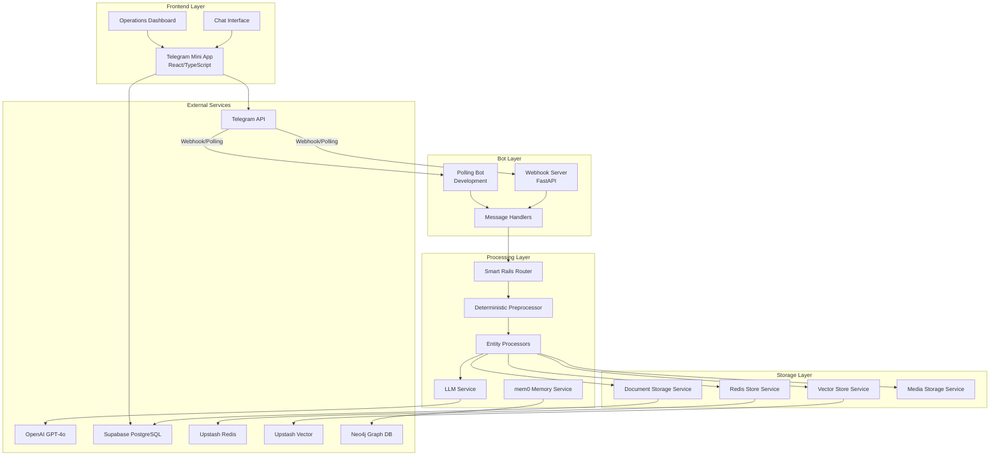

# Architecture Overview

## Executive Summary

This document outlines the comprehensive system architecture for the BrainBot FLRTS project. The architecture is designed to be modular, scalable, and performant, leveraging a webhook-based model for real-time message processing and the "Smart Rails" system for efficient, cost-effective LLM interactions.

The system is composed of five primary layers:
1.  **Bot Layer**: Handles communication with the Telegram API.
2.  **Processing Layer**: Implements the core "Smart Rails" logic for message routing and entity extraction.
3.  **Storage Layer**: Manages data persistence across various storage backends.
4.  **Intelligence Layer**: Interfaces with external AI services like OpenAI and provides memory capabilities.
5.  **Frontend Layer**: Provides a rich user interface through a Telegram Mini App.

## High-Level Architecture

## System Principles

1. **Modular Design**: Each component has a single responsibility
2. **Loose Coupling**: Components communicate via well-defined interfaces
3. **High Cohesion**: Related functionality is grouped together
4. **Fail-Safe**: Graceful degradation when services are unavailable
5. **Performance First**: Smart Rails preprocessing for efficiency
6. **Audit Everything**: Complete source tracking and version control
