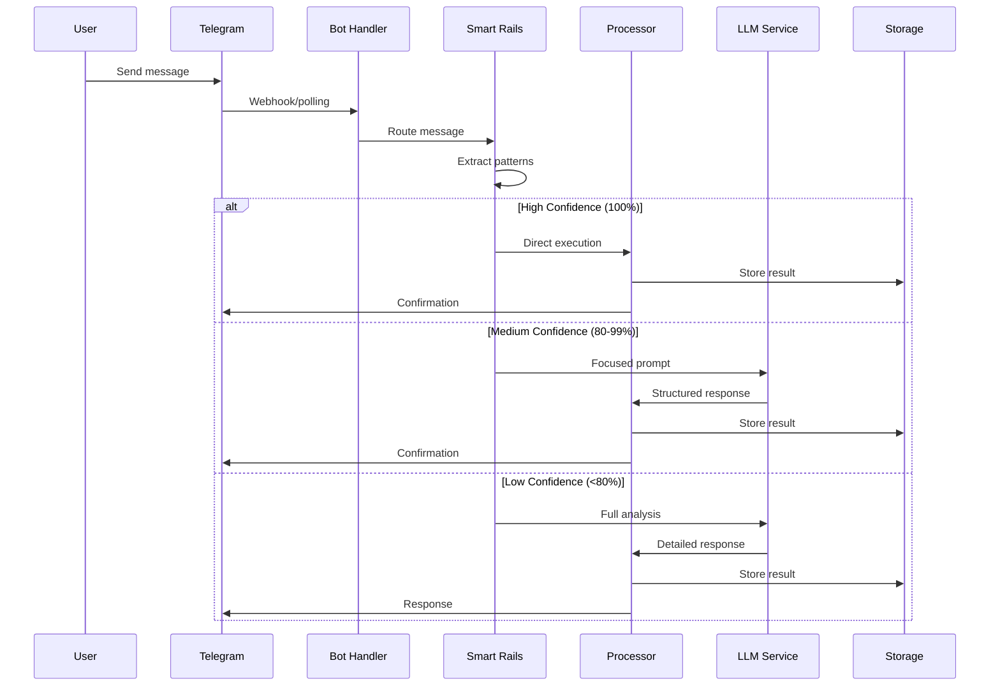
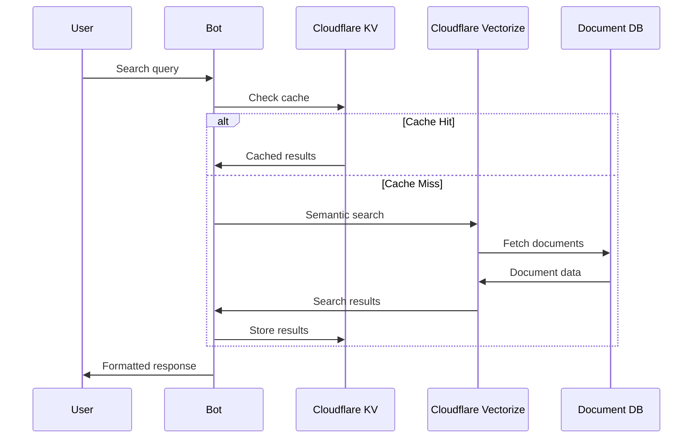

# Data Flow and Integration Architecture

## 1. Message Processing Flow

## 2. Search and Retrieval Flow

## 3. Integration Points

### External APIs
- **Telegram Bot API**: Primary interface for user interaction
- **OpenAI API**: Natural language processing and generation
- **Supabase API**: Database operations and real-time subscriptions
- **Cloudflare APIs**: KV and Vectorize operations (migrating from Upstash - see [Stories 2.13](../stories/2.13.story.md) and [2.14](../stories/2.14.story.md))
- **Neo4j API**: Graph memory operations (when enabled)
- **Cloudflare Workers**: Queue processing and webhook handling

### Webhook Endpoints
- **Telegram Webhook**: `/webhook/telegram` - Receive message updates
- **Process Endpoint**: `/process` - Handle queued messages from Cloudflare
- **Memory Webhooks**: `/webhook/mem0` - Graph memory notifications
- **Health Check**: `/health` - Service availability monitoring
- **Detailed Health**: `/health/detailed` - Component-level health status

### Mini App Integration
- **WebSocket Connection**: Real-time updates between bot and app
- **REST API**: Standard CRUD operations for entities
- **Authentication**: Telegram Web App authentication
- **Session Management**: Cloudflare KV session storage (migrating from Redis - see [Story 2.13](../stories/2.13.story.md))

## 4. Core Components Integration

### Bot Handler
- Receives messages from Telegram
- Manages user sessions
- Handles command processing
- Sends responses back to users

### Smart Rails Router
- Pattern recognition and extraction
- Confidence scoring
- Dynamic prompt generation
- Intent classification

### Processors
- Task processor for task management
- List processor for inventory management
- Report processor for field reports
- Direct database operations

### Storage Layer
- Supabase for structured data
- Cloudflare KV for caching (migrating from Upstash Redis - see [Story 2.13](../stories/2.13.story.md))
- Cloudflare Vectorize for semantic search (migrating from Upstash Vector - see [Story 2.14](../stories/2.14.story.md))
- Neo4j for graph relationships (optional)