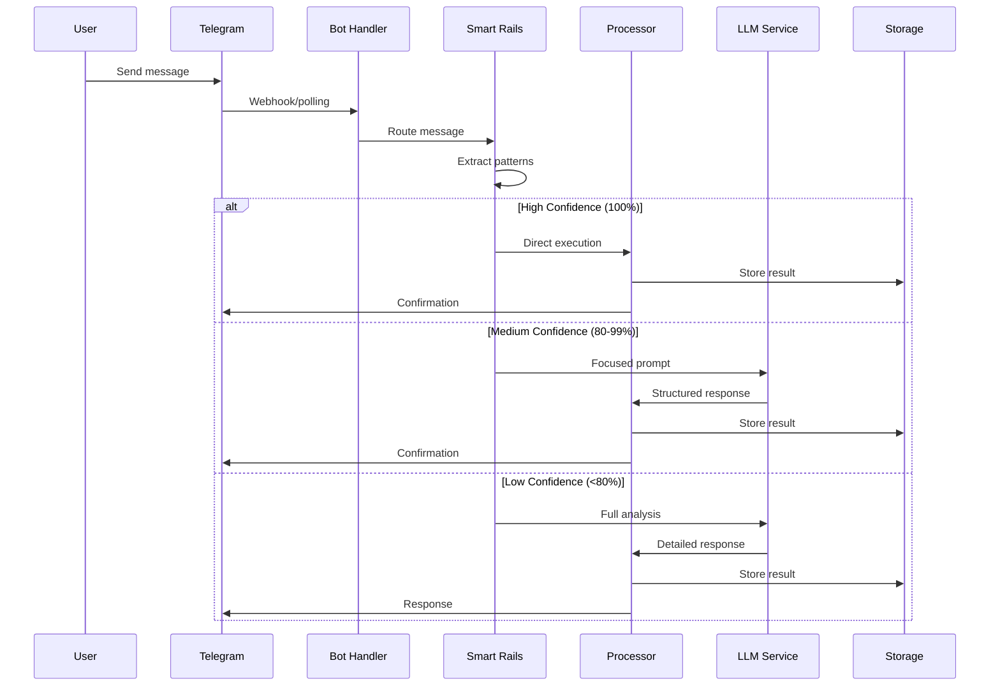
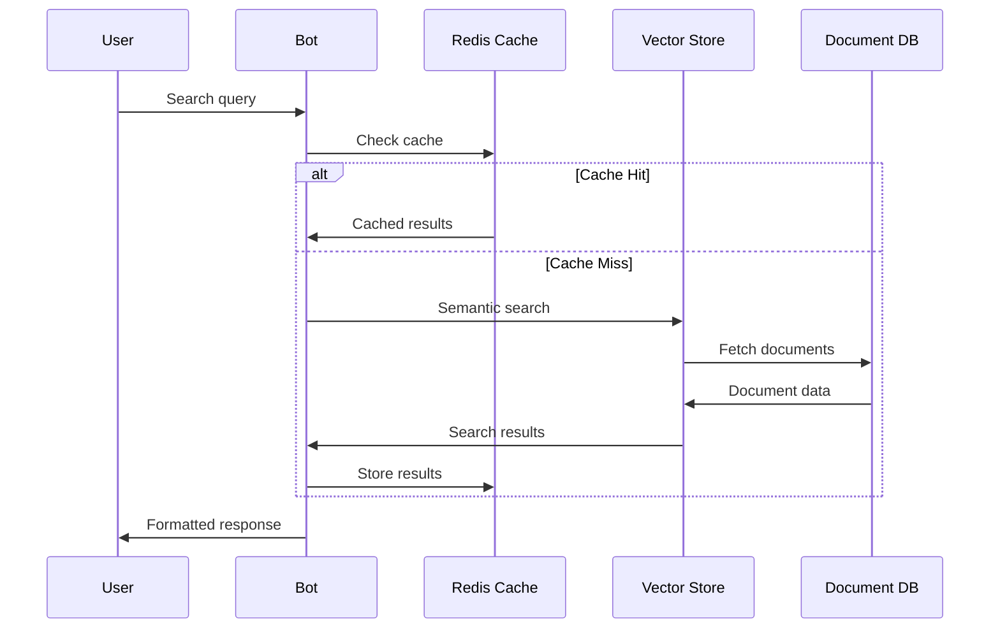

# Data Flow Architecture

## 1. Message Processing Flow

```mermaid
sequenceDiagram
    participant User
    participant TG as Telegram
    participant Bot as Bot Handler
    participant Router as Smart Rails
    participant Proc as Processor
    participant LLM as LLM Service
    participant DB as Storage

    User->>TG: Send message
    TG->>Bot: Webhook/polling
    Bot->>Router: Route message
    Router->>Router: Extract patterns
    
    alt High Confidence (100%)
        Router->>Proc: Direct execution
        Proc->>DB: Store result
        Proc->>TG: Confirmation
    else Medium Confidence (80-99%)
        Router->>LLM: Focused prompt
        LLM->>Proc: Structured response
        Proc->>DB: Store result
        Proc->>TG: Confirmation
    else Low Confidence (<80%)
        Router->>LLM: Full analysis
        LLM->>Proc: Detailed response
        Proc->>DB: Store result
        Proc->>TG: Response
    end
```

## 2. Search and Retrieval Flow

```mermaid
sequenceDiagram
    participant User
    participant Bot
    participant Cache as Redis Cache
    participant Vector as Vector Store
    participant DB as Document DB

    User->>Bot: Search query
    Bot->>Cache: Check cache
    
    alt Cache Hit
        Cache->>Bot: Cached results
    else Cache Miss
        Bot->>Vector: Semantic search
        Vector->>DB: Fetch documents
        DB->>Vector: Document data
        Vector->>Bot: Search results
        Bot->>Cache: Store results
    end
    
    Bot->>User: Formatted response
```
