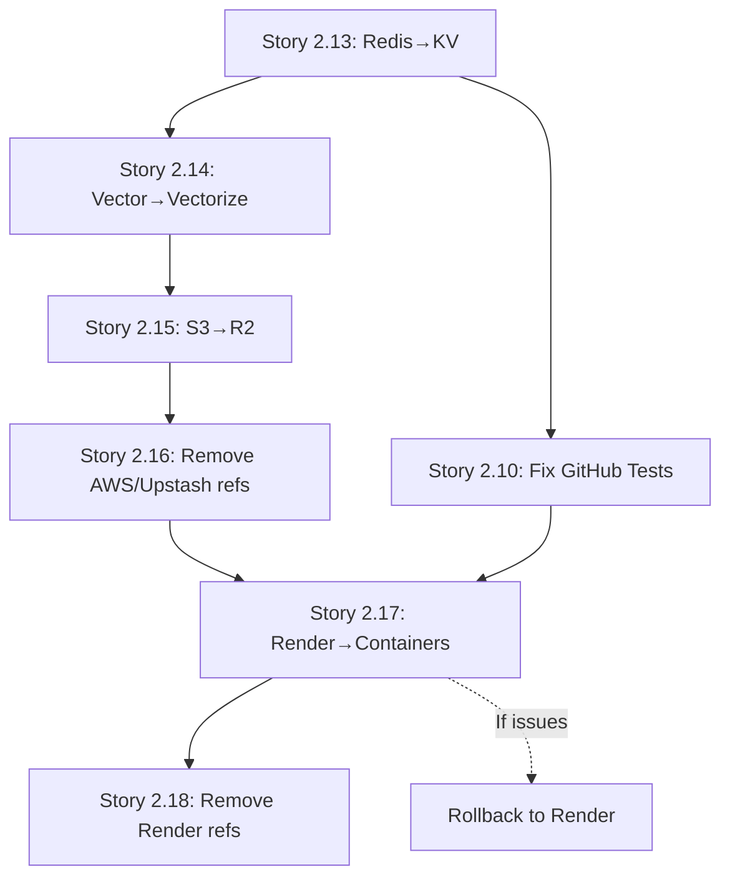

# Epic 2 Infrastructure Migration Checklist

## Migration Story Sequence (MUST be done in order)

### Phase 1: Data Layer Migration (Stories 2.13-2.15)
These MUST be completed sequentially as each builds on the previous:

- [ ] **Story 2.13**: Complete Upstash Redis → Cloudflare KV migration
  - [ ] All caching moved to KV
  - [ ] Session management on KV
  - [ ] Tests passing
  
- [ ] **Story 2.14**: Complete Upstash Vector → Cloudflare Vectorize migration
  - [ ] All embeddings migrated
  - [ ] Search functionality working
  - [ ] Performance validated
  
- [ ] **Story 2.15**: Complete AWS S3 → Cloudflare R2 migration
  - [ ] All media files transferred
  - [ ] Upload/download working
  - [ ] Public URLs functional

### Phase 2: Clean Up Legacy References (Story 2.16)
Only AFTER all data migrations are complete:

- [ ] **Story 2.16**: Complete Removal of AWS and Upstash References
  - [ ] All source code cleaned
  - [ ] All tests updated
  - [ ] All documentation updated
  - [ ] Legacy scripts archived

### Phase 3: Infrastructure Migration (Story 2.17)
Only AFTER all data is on Cloudflare:

- [ ] **Story 2.17**: Complete Infrastructure Migration to Cloudflare Containers
  - [ ] Backend deployed to Containers
  - [ ] Frontend deployed to Pages
  - [ ] All webhooks working
  - [ ] DNS switched over
  - [ ] Monitoring for 24-48 hours

### Phase 4: Final Cleanup (Story 2.18)
Only AFTER Cloudflare deployment is stable:

- [ ] **Story 2.18**: Complete Removal of Render References
  - [ ] render.yaml deleted
  - [ ] Documentation updated
  - [ ] CI/CD updated
  - [ ] Legacy guides archived

## Critical Safety Measures

### Branch Strategy
- [ ] Use `feature/cloudflare-migration` branch for Story 2.17
- [ ] Keep develop branch deployable during entire migration
- [ ] Only merge after full verification

### Rollback Preparation
- [ ] Document rollback procedure before starting Story 2.17
- [ ] Keep Render running until Story 2.17 is fully verified
- [ ] Test DNS switching between services
- [ ] Have emergency contact info ready

### Testing Requirements
- [ ] All unit tests pass after each story
- [ ] Integration tests pass after each story
- [ ] Manual verification checklist for each story
- [ ] Performance testing after data migrations

## Dependencies Between Stories

## Story Points Allocation
- Story 2.13: 8 points (Redis migration)
- Story 2.14: 13 points (Vector migration + data transfer)
- Story 2.15: 8 points (S3 migration + file transfer)
- Story 2.16: 5 points (Cleanup references)
- Story 2.17: 21 points (Major infrastructure change)
- Story 2.18: 3 points (Final cleanup)

**Total: 58 points** (substantial Epic 2 expansion)

## Success Criteria
- [ ] Zero downtime during migration
- [ ] All functionality working on Cloudflare
- [ ] Performance meets or exceeds current metrics
- [ ] Clean codebase with no legacy references
- [ ] Successful rollback procedure documented and tested