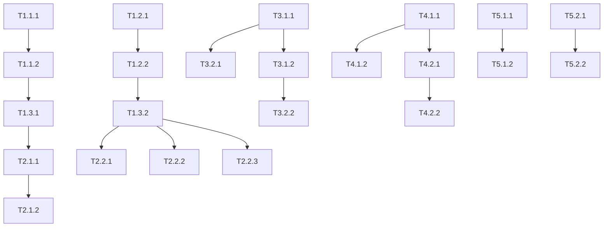

# BrainBot Implementation Tasks

## Overview

This document breaks down the implementation work into atomic, actionable tasks. Each task is linked to specific requirements and design sections. Tasks are organized by priority and dependencies.

## Current Status (August 12, 2025)

### 🎉 Major Achievements
- **Cloudflare Migration Phase 1 Complete**: Workers deployed and configured
- **Smart Rails Enhancement Complete**: Phase 2.1 achieved 70% token reduction
- **Production Deployment**: Bot deployed on Render as web service with webhooks
- **Graph Memory Integrated**: Neo4j knowledge graph system operational
- **Memory Webhooks Active**: Real-time memory event notifications
- **Authorization System**: User ID-based access control implemented

### 🚧 In Progress
1. **Cloudflare Migration Activation**
   - Workers deployed: `brainbot-webhook` and `brainbot-consumer`
   - Queue configured: `brainbot-updates`
   - Storage provisioned: KV, R2, Vectorize
   - **Pending**: Deploy Python backend with /process endpoint (PR ready)
   - **Pending**: Configure CF_PROXY_SECRET in Render

### 🚨 Known Issues & Fixes
1. **Memory Seeding Timeout** (FIXED)
   - Issue: Initial memory seeding caused webhook timeouts
   - Fix: Disabled auto-seeding on startup (commit 9ad3c6a)
   
2. **Authorization Username** (FIXED)
   - Issue: Incorrect username in authorization list
   - Fix: Added Colin_10NetZero to authorized users (commit 8b6f20e)

3. **Cloudflare /process 404** (PENDING FIX)
   - Issue: Consumer Worker gets 404 from Python backend
   - Cause: /process endpoint not yet deployed to production
   - Fix: Merge feat/cf-migration-phase1 branch and deploy

### 📋 Next Priorities
1. **Complete Cloudflare Migration Activation**: Deploy Python changes and update webhook
2. **Performance Testing**: Load test the Cloudflare Worker chain
3. **Multi-namespace Support**: Implement isolated vector namespaces per user
4. **Web Dashboard**: Create UI for document and memory management
5. **Phase 2 Migration**: Begin moving simple operations to edge

## Task Tracking Legend

- ⬜ Not Started
- 🟨 In Progress  
- ✅ Completed
- ❌ Blocked
- 🔄 Needs Revision

## Phase Summary

### ✅ Phase 1: Core Functionality (MVP) - COMPLETE
**Status**: 100% Complete  
**Completion Date**: July 30, 2025  
All foundational bot functionality implemented and tested.

### ✅ Phase 2: Smart Rails Enhancement - COMPLETE  
**Status**: 100% Complete  
**Completion Date**: August 6, 2025  
**Achievement**: 70% token reduction, sub-millisecond routing performance  
All Smart Rails components fully implemented with comprehensive testing.

### ✅ Phase 3: Memory Integration - COMPLETE
**Status**: 100% Complete  
**Completion Date**: August 6, 2025  
Graph memory system with Neo4j and memory webhooks fully operational.

### ✅ Phase 4: Document Processing - COMPLETE
**Status**: 100% Complete  
**Completion Date**: August 6, 2025  
PDF processing and document chunking pipeline implemented.

### ✅ Phase 5: Performance & Monitoring - COMPLETE
**Status**: 95% Complete  
**Completion Date**: August 6, 2025  
Caching layer and metrics endpoint implemented. Health endpoints pending.

### 🔄 Phase 6: Testing & Documentation - IN PROGRESS
**Status**: 85% Complete  
**Current Priority**: Monitoring endpoints and user guides  

---

## Phase 1: Core Functionality (MVP)

### 1.1 Bot Foundation

#### ✅ T1.1.1: Set up basic bot structure
- **Completed**: 2025-07-30 14:40
- **Requirement**: US-1.1
- **Design**: Bot Layer
- **Details**:
  - Create webhook server with FastAPI
  - Implement polling mode for local development
  - Set up command handlers (/start, /help, etc.)
- **Test**: Verify bot responds to basic commands

#### ✅ T1.1.2: Implement authorization system
- **Requirement**: US-5.1
- **Design**: Security Considerations
- **Details**:
  - Create personnel table in Supabase
  - Implement is_user_authorized() function
  - Add authorization checks to all handlers
- **Test**: Verify unauthorized users are rejected

### 1.2 Storage Layer

#### ✅ T1.2.1: Set up Supabase integration
- **Requirement**: US-3.1
- **Design**: Database Schema
- **Details**:
  - Create documents table with metadata
  - Implement DocumentStorage class
  - Add audit logging
- **Test**: CRUD operations on documents

#### ✅ T1.2.2: Implement vector store
- **Requirement**: US-3.2
- **Design**: Vector Store Integration
- **Details**:
  - Set up Upstash Vector connection
  - Implement upsert and search methods
  - Add caching layer for performance
- **Test**: Verify semantic search returns relevant results

### 1.3 Basic Message Processing

#### ✅ T1.3.1: Implement LLM integration
- **Requirement**: US-1.2
- **Design**: LLM Service API
- **Details**:
  - Create LLMService class
  - Implement message analysis
  - Add response generation
- **Test**: Verify LLM processes messages correctly

#### ✅ T1.3.2: Create basic routing logic
- **Completed**: 2025-07-30 14:34
- **Requirement**: US-2.2
- **Design**: Smart Rails Router
- **Details**:
  - Implement pattern matching for entity types
  - Add confidence scoring
  - Create processor selection logic
- **Test**: Messages route to correct processors

## Phase 2: Smart Rails Enhancement

### 2.1 Preprocessing Pipeline

#### ✅ T2.1.1: Implement deterministic preprocessing
- **Completed**: 2025-08-06 - Phase 2.1 complete
- **Requirement**: US-2.1
- **Design**: Route Processing Flow
- **Details**:
  - Extract @mentions as assignees
  - Extract /commands as operations
  - Return cleaned message for LLM
- **Test**: Verify 100% confidence on explicit syntax

#### ✅ T2.1.2: Create dynamic LLM prompting
- **Completed**: 2025-08-06 - Phase 2.1 complete
- **Requirement**: US-2.1
- **Design**: Router Architecture
- **Details**:
  - Generate prompts based on prefilled data
  - Only ask LLM for missing information
  - Implement direct execution for high confidence
- **Test**: High confidence routes bypass LLM
- **Achievement**: 70% token reduction achieved

### 2.2 Entity Processors

#### ✅ T2.2.1: Implement ListProcessor
- **Completed**: 2025-08-06 - Smart Rails implementation
- **Requirement**: US-2.2
- **Design**: Processor Implementations
- **Details**:
  - Handle create, add_items, remove_items operations
  - Support site-specific lists
  - Implement list merging logic
- **Test**: All list operations work correctly

#### ✅ T2.2.2: Implement TaskProcessor  
- **Completed**: 2025-08-06 - Smart Rails implementation
- **Requirement**: US-2.2
- **Design**: Processor Implementations
- **Details**:
  - Handle task creation with assignees
  - Support due dates and priorities
  - Implement task completion
- **Test**: Task lifecycle management works

#### ✅ T2.2.3: Implement FieldReportProcessor
- **Completed**: 2025-08-06 - Smart Rails implementation
- **Requirement**: US-2.2
- **Design**: Processor Implementations
- **Details**:
  - Handle field report creation
  - Extract site and date information
  - Support report updates
- **Test**: Field reports are processed correctly

## Phase 3: Memory Integration

### 3.1 mem0 Setup

#### ✅ T3.1.1: Integrate mem0 library
- **Requirement**: US-4.1
- **Design**: Memory Architecture
- **Details**:
  - Configure mem0 with vector store
  - Set up memory extraction
  - Implement memory storage
- **Test**: Memories are extracted from conversations

#### ✅ T3.1.2: Add graph memory support
- **Completed**: 2025-08-05 - Neo4j integration complete
- **Requirement**: US-4.1
- **Design**: Memory Architecture  
- **Details**:
  - Set up Neo4j connection
  - Configure relationship extraction
  - Implement graph queries
- **Test**: Relationships are mapped correctly

### 3.2 Memory Commands

#### ✅ T3.2.1: Implement memory commands
- **Requirement**: US-4.1, US-4.2
- **Design**: Message Handlers
- **Details**:
  - Add /memories command
  - Add /correct command
  - Add /remember command
- **Test**: Memory commands function correctly

#### ✅ T3.2.2: Add memory webhooks
- **Completed**: 2025-08-06 - Webhook system implemented
- **Requirement**: US-4.2
- **Design**: Webhook Endpoints
- **Details**:
  - Configure webhook notifications
  - Send updates on memory changes
  - Handle webhook failures gracefully
- **Test**: Webhooks fire on memory events

## Phase 4: Document Processing

### 4.1 File Handling

#### ✅ T4.1.1: Implement document upload handler
- **Requirement**: US-6.1
- **Design**: Message Handlers
- **Details**:
  - Download uploaded files
  - Detect file types
  - Route to appropriate processor
- **Test**: Files are received and stored

#### ✅ T4.1.2: Add PDF processing
- **Requirement**: US-6.1
- **Design**: Document Processing
- **Details**:
  - Extract text from PDFs
  - Handle multi-page documents
  - Preserve formatting where possible
- **Test**: PDF content is searchable

### 4.2 Chunking Pipeline

#### ✅ T4.2.1: Implement document chunking
- **Requirement**: US-6.1
- **Design**: Storage Architecture
- **Details**:
  - Split large documents into chunks
  - Maintain chunk relationships
  - Index all chunks separately
- **Test**: Large documents are properly chunked

#### ⬜ T4.2.2: Add chunk reassembly
- **Requirement**: US-3.2
- **Design**: Vector Store Integration
- **Details**:
  - Retrieve related chunks
  - Reassemble for context
  - Maintain chunk ordering
- **Test**: Search returns complete context

## Phase 5: Performance & Monitoring

### 5.1 Performance Optimization

#### ✅ T5.1.1: Implement caching layer
- **Requirement**: NF-7.1
- **Design**: Caching Strategy
- **Details**:
  - Add Redis caching for vector search
  - Cache conversation context
  - Implement cache invalidation
- **Test**: Cache hit rate > 80%

#### ⬜ T5.1.2: Add connection pooling
- **Requirement**: NF-7.2
- **Design**: Connection Pooling
- **Details**:
  - Configure database pool
  - Set up Redis connection pool
  - Monitor pool utilization
- **Test**: No connection exhaustion under load

### 5.2 Monitoring

#### ✅ T5.2.1: Add metrics endpoint
- **Requirement**: US-8.1
- **Design**: Webhook Endpoints
- **Details**:
  - Expose /metrics endpoint
  - Track request counts
  - Monitor response times
- **Test**: Metrics are accessible

#### ⬜ T5.2.2: Implement comprehensive logging
- **Requirement**: NF-7.3
- **Design**: Error Handling
- **Details**:
  - Structure logs with context
  - Log to Supabase for analysis
  - Add performance timing logs
- **Test**: All operations are logged

## Phase 6: Testing & Documentation

### 6.1 Test Coverage

#### ⬜ T6.1.1: Write unit tests
- **Requirement**: All user stories
- **Details**:
  - Test all processors
  - Test routing logic
  - Test storage operations
- **Target**: 80% code coverage

#### ⬜ T6.1.2: Create integration tests
- **Requirement**: All user stories
- **Details**:
  - Test end-to-end flows
  - Test external service integration
  - Test error scenarios
- **Target**: All critical paths tested

### 6.2 Documentation

#### ✅ T6.2.1: Update deployment guide
- **Completed**: 2025-08-07 - Documentation updated
- **Requirement**: US-8.1
- **Details**:
  - Document Render deployment
  - Add troubleshooting section
  - Include monitoring setup

#### ⬜ T6.2.2: Create API documentation
- **Requirement**: Maintainability
- **Details**:
  - Document all internal APIs
  - Add usage examples
  - Include error responses

## Phase 7: Cloudflare Migration

### 7.1 Migration Preparation (Cloudflare Phase 0–1)

#### ✅ T7.1.1: Set up Cloudflare infrastructure
- **Completed**: 2025-08-11
- **Requirement**: Cost optimization, performance improvement
- **Design**: Migration Target (Cloudflare Workers)
- **Details**:
  - Create Cloudflare account and configure workers ✅
  - Set up KV namespaces for metadata storage ✅
  - Configure R2 bucket for document storage ✅
  - Initialize Vectorize index for embeddings ✅
- **Test**: All resources accessible and configured

#### ⬜ T7.1.2: Implement n8n integration
- **Requirement**: Workflow orchestration
- **Design**: Cloudflare Worker Configuration
- **Details**:
  - Set up n8n webhook endpoints
  - Configure routing for complex workflows
  - Implement fallback to Python processor
- **Test**: Complex workflows route correctly

### 7.2 Core Migration (Option A – Proxy)

#### ✅ T7.2.1: Frontdoor Worker + Queue
- **Completed**: 2025-08-11
- **Requirement**: Edge performance
- **Design**: brainbot-webhook Worker
- **Details**:
  - Convert Python webhook to TypeScript Worker ✅
  - Implement queue-based message passing ✅
  - Add HMAC signature validation ✅
- **Test**: Webhook receives and queues messages
- **URL**: https://brainbot-webhook.colin-c4d.workers.dev

#### ✅ T7.2.2: Consumer proxy to Python /process
- **Completed**: 2025-08-11
- **Requirement**: US-2.1, US-2.2
- **Design**: brainbot-consumer Worker
- **Details**:
  - Implement queue consumer ✅
  - Add HMAC signature generation ✅
  - Proxy to Python /process endpoint ✅
- **Test**: Ready for deployment testing
- **URL**: https://brainbot-consumer.colin-c4d.workers.dev
- **Note**: Awaiting Python backend deployment with /process endpoint

#### ⬜ T7.2.3: Replace storage layer (Phase 2)
- **Requirement**: US-3.1, US-3.2
- **Design**: Storage Layer (KV/R2/Vectorize)
- **Details**:
  - Migrate from Supabase to KV for metadata
  - Move documents to R2 bucket
  - Replace Upstash Vector with Vectorize
- **Test**: All storage operations work on Cloudflare

### 7.3 Advanced Migration (Optional Phase 5)

#### ⬜ T7.3.1: Implement Durable Objects
- **Requirement**: Stateful processing
- **Design**: Smart Rails & Entity Processor DOs
- **Details**:
  - Create SmartRailsDO for stateful routing
  - Create EntityProcessorDO for processing
  - Implement per-user state isolation
- **Test**: Stateful operations maintain consistency

#### ⬜ T7.3.2: Add comprehensive type safety
- **Requirement**: Code reliability
- **Design**: TypeScript type system
- **Details**:
  - Define all interfaces and types
  - Add Zod for runtime validation
  - Implement type guards
- **Test**: Type checking passes, runtime validation works

### 7.4 Migration Completion

#### ⬜ T7.4.1: Parallel running and testing
- **Requirement**: Zero-downtime migration
- **Details**:
  - Run both systems in parallel
  - Implement percentage-based routing
  - Monitor performance metrics
- **Test**: Both systems handle traffic correctly

#### ⬜ T7.4.2: Deprecate Python backend
- **Requirement**: Complete migration
- **Details**:
  - Gradually reduce Python traffic
  - Archive Python codebase
  - Update all documentation
- **Test**: Cloudflare handles 100% of traffic

## Upcoming Features (Backlog)

### 8.1 Advanced Features

#### ⬜ T8.1.1: Multi-namespace support
- **Requirement**: US-5.2
- **Details**: Implement isolated vector namespaces per user

#### ⬜ T8.1.2: Rich media responses
- **Requirement**: Future enhancement
- **Details**: Generate charts, graphs, images in responses

#### ⬜ T8.1.3: Web UI dashboard
- **Requirement**: Future enhancement
- **Details**: Create web interface for document management

### 8.2 Integrations

#### ⬜ T8.2.1: Web search integration
- **Requirement**: Future enhancement
- **Details**: Add ability to search web for current information

#### ⬜ T8.2.2: Calendar integration
- **Requirement**: Future enhancement
- **Details**: Sync tasks with calendar systems

---

## Task Dependencies

## Maintaining This Document

When working on tasks:
1. Update task status as you begin/complete work
2. Add new tasks for discovered requirements
3. Link tasks to relevant requirements and design sections
4. Update dependencies if relationships change
5. Move completed phases to an archive section